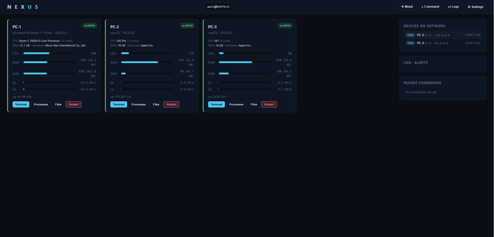

# Nexus

Nexus is a device management and remote terminal system built on a hub + agent architecture. The central server (hub) lists connected devices and shows their status; it provides terminal access, a file explorer, process manager, batch commands, alert notifications, and automatic updates.



## Features

- **Real-time monitoring** — CPU, RAM, disk, network, uptime (each agent uses `systeminformation`)
- **Remote terminal** — real PTY on every device (`node-pty`); sessions are logged
- **File explorer** — browse folders, upload/download files
- **Process manager** — live list + kill
- **Batch commands** — run a command on selected/all devices at once
- **Command whitelist** — only allowed commands (via `config.json`) can run
- **Alerts / threshold notifications** — CPU/RAM/disk thresholds + offline detection (Telegram + Discord)
- **Mobile access** — PWA + QR code
- **Service install** — systemd / launchd / Windows Startup (one command)
- **One-command install** — `install.sh` / `install.ps1`
- **Auto-update** — hub and all agents update on git push
- **LAN discovery** — automatically finds every hub/agent on the same subnet (UDP 8889)

## Requirements

- Node.js 18+ (18.20 or 20+ recommended)
- npm
- Git

## One-Command Install

**Linux / macOS:**

```bash
curl -sSL https://raw.githubusercontent.com/muratdemirci/nexus/main/install.sh | bash
```

**Windows (PowerShell as admin):**

```powershell
Invoke-Expression (Invoke-RestMethod https://raw.githubusercontent.com/muratdemirci/nexus/main/install.ps1)
```

The install scripts check for node/npm/git, clone the repo, install dependencies, and (optionally) register it as a service.

## Manual Install

```bash
cd nexus
npm install
npm run gen-icons   # PWA icons (first install only)
```

## Running

### Connecting multiple computers on the same LAN (discovery)

Nexus automatically discovers computers on the same subnet via UDP broadcast
(`discovery.js`, UDP port `8889`). Every machine broadcasts a hub beacon, and
every agent finds **all** hubs on the LAN and connects to **all of them**. No IP
entering required — just run `npm start`. The **"DEVICES ON NETWORK"** panel in
the UI lists discovered devices.

> **Firewall (Windows):** allow incoming connections for discovery (`UDP 8889`)
> and the web UI (`TCP 8888`). `npm run install:service` also tries to add
> firewall rules; if you lack permissions, run these manually:
>
> ```bat
> netsh advfirewall firewall add rule name="Nexus Hub 8888" dir=in action=allow protocol=TCP localport=8888
> netsh advfirewall firewall add rule name="Nexus Discovery 8889" dir=in action=allow protocol=UDP localport=8889
> ```

### Hub (web UI)

```bash
npm run hub        # or: node index.js --mode hub
# http://localhost:8888
```

### Agent

```bash
npm run agent      # or: node index.js --mode agent --hub http://localhost:8888
```

### Hub + Agent together

```bash
npm start
```

### Installing / removing as a service

- Linux : `npm run install:service` (with sudo) → systemd `nexus` service
- macOS : `npm run install:service` → launchd `com.nexus` agent
- Windows: `npm run install:service` → Startup folder shortcut

To remove on all platforms: `npm run uninstall:service`

## Custom settings (`config.json`)

```jsonc
{
  // Command whitelist: empty = allow all. Non-empty = only commands
  // starting with these prefixes can run (in the batch command feature).
  "whitelist": ["ls", "df", "ps", "free", "uptime", "ping", "ipconfig"],
  "thresholds": {
    "cpu": 90,        // CPU % threshold (alarm when exceeded)
    "ram": 90,        // RAM %
    "disk": 90,       // Disk %
    "offline": 60     // seconds before a device is considered offline
  },
  "notify": {
    "telegram": { "token": "", "chatId": "" },
    "discord":  { "webhook": "" }
  },
  "qrHost": "",       // QR/mobile access address (optional; defaults to LAN IP)
  "tailscale": true   // show tailscale IP in the UI
}
```

Thresholds and notification settings can also be changed from the UI (**⚙ Settings** button, `POST /api/config`).

## CLI options

```bash
node index.js --mode hub --port 8888
node index.js --mode agent --hub http://192.168.1.10:8888 --name RaspberryPi
node index.js --install      # install as a service
node index.js --uninstall    # remove the service
node index.js --no-discover  # disable LAN discovery
node index.js --no-firewall  # skip firewall handling
```

All options: `--mode/-m`, `--port/-p`, `--hub/-H`, `--name/-n`,
`--interval/-i`, `--repo/-r`, `--update-branch/-b`, `--update-interval`,
`--no-discover`, `--no-firewall`, `--install`, `--uninstall`.

## REST API (no auth required on the same LAN — careful: anyone can use it)

| Method | Path | Description |
| --- | --- | --- |
| GET | `/api/agents` | connected agent list |
| GET | `/api/network` | discovered network devices |
| POST | `/api/run` | `{agentIds[], command, cwd, timeout}` → batch command |
| GET | `/api/processes/:agentId` | process list |
| POST | `/api/kill` | `{agentId, pid}` |
| GET | `/api/fs?agent=&path=` | directory listing |
| GET | `/api/download?agent=&path=` | download a file |
| POST | `/api/upload?agent=&path=` | upload a file (raw body) |
| POST | `/api/restart/:agentId` | restart an agent |
| GET | `/api/history` | command history |
| GET | `/api/logs` / `/api/logs/:termId` | terminal session logs |
| GET | `/api/qr?host=` | mobile access QR (PNG) |
| GET | `/api/hostinfo` | LAN/tailscale addresses |
| GET/POST | `/api/config` | read/update settings |

## Security note

This version has no authentication / TLS; it is intended only for trusted,
same-LAN networks and tailscale-like VPNs. Filling in the command whitelist
reduces the attack surface at least somewhat outside trusted networks. Before
exposing it to the internet, always add a reverse proxy + authentication.

## Troubleshooting

1. Make sure the hub is running
2. Check the agent's `--hub` address
3. Make sure ports 8888 (TCP) and 8889 (UDP) are open
4. If needed, re-run `npm install` and `npm run gen-icons`
5. If you see `posix_spawnp failed` in the macOS terminal, re-run `npm install`
   (the agent also repairs native binary permissions itself at startup)
